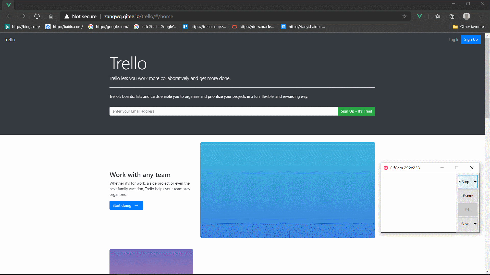
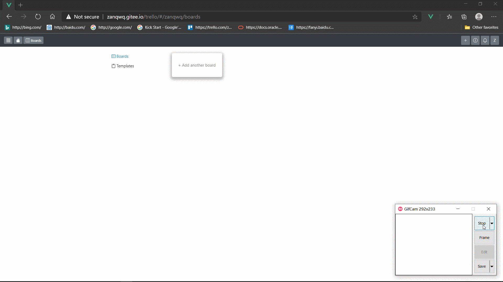
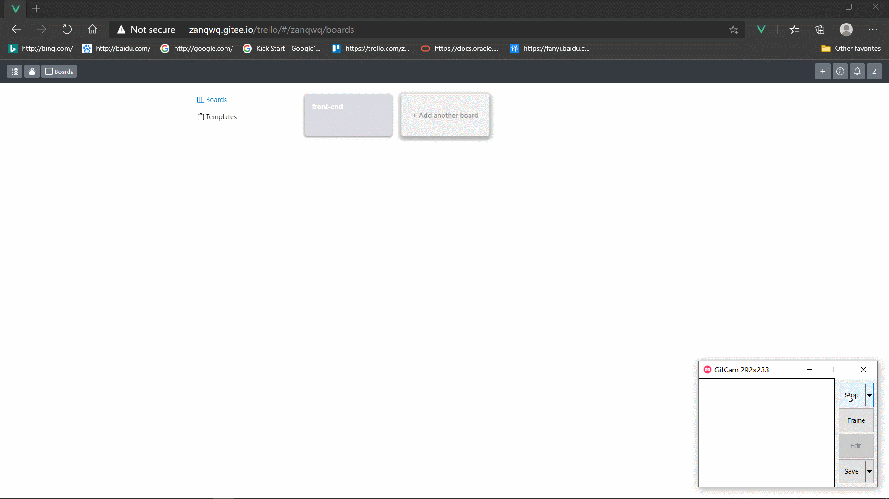
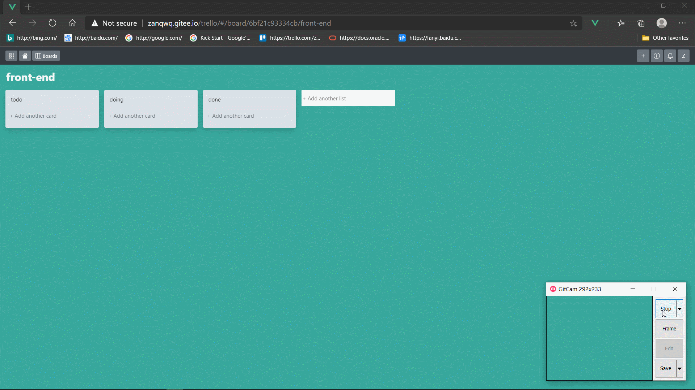

# trello

## 项目特点

* 基于`Vue` 全家桶和`BootstrapVue` UI框架的todo列表, 使用 drag & drop API 实现拖动效果.
* `localStorage` 本地存储数据
* 响应式的布局
  


## 项目指南

### 本地注册




### 增加看板 删除看板




### 增加列表 删除列表 拖动列表




### 增加卡片 编辑卡片 删除卡片 拖动卡牌



## Project setup
```
npm install
```

### Compiles and hot-reloads for development
```
npm run serve
```

### Compiles and minifies for production
```
npm run build
```

### Lints and fixes files
```
npm run lint
```

### Customize configuration
See [Configuration Reference](https://cli.vuejs.org/config/).
